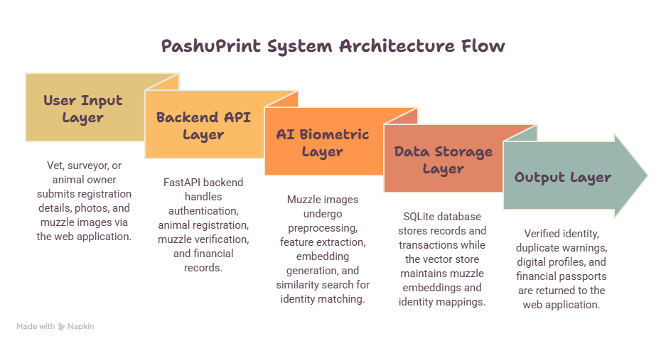

# PashuPrint

### Muzzle Biometrics for Livestock Identity Verification

PashuPrint is an AI-powered livestock identity verification system that uses
cow muzzle patterns as an additional biometric layer to help detect animal
identity mismatches and duplicate registrations in livestock insurance.

## Problem

Livestock insurance relies heavily on physical identification such as ear
tags and photographs. These identifiers can be lost, swapped, reused, or
otherwise fail to establish that the animal presented during a claim is the
same animal that was originally registered.

PashuPrint adds an additional identity layer by comparing the cow's muzzle
pattern against previously registered animals.

## Solution

PashuPrint:

- Captures a cow's muzzle image during registration
- Extracts biometric features using a deep-learning model
- Stores the resulting embedding for the registered animal
- Compares a new muzzle image against registered animals
- Returns the top matching animals with similarity scores
- Flags suspicious cases for human review
- Maintains a verification history for each animal

## Workflow

Registration:

Vet/Surveyor
    ↓
Animal + Muzzle Photo
    ↓
Image Quality Check
    ↓
Duplicate Photo Check
    ↓
Muzzle Feature Extraction
    ↓
Embedding Storage
    ↓
Animal Registered

Verification:

Claim Photo
    ↓
Image Quality Check
    ↓
Muzzle Feature Extraction
    ↓
Similarity Matching
    ↓
Top-3 Matches
    ↓
High Confidence / Low Confidence / No Match
    ↓
Fraud Flag + Human Review (when required)

## System Architecture

## Tech Stack

### Frontend
- Streamlit

### Backend
- Python
- FastAPI
- SQLite

### Machine Learning
- PyTorch
- ResNet50
- NumPy
- OpenCV

### Development
- Git
- GitHub

## Dataset

We use the BeefCattle Muzzle Dataset as a feasibility benchmark for muzzle
biometric identification.

- 4,923 cropped muzzle images
- 268 individual cattle
- Approximately 644 MB

The dataset is used for training and evaluating the muzzle recognition
pipeline.

> Note: The current dataset contains American beef cattle and is not
> representative of all Indian cattle breeds. Results are therefore treated
> as a feasibility benchmark rather than evidence of deployment-level
> performance in India.

## Machine Learning Approach

1. Preprocess muzzle images
2. Fine-tune a ResNet50 model
3. Extract muzzle embeddings
4. L2-normalize embeddings
5. Compare query and registered embeddings using cosine similarity
6. Return the top-3 matches
7. Apply an empirically determined confidence threshold

## Fraud / Risk Cases

PashuPrint can flag:

- Duplicate registration
- Animal identity mismatch during claim verification
- No matching registered animal
- Low-confidence biometric match
- Duplicate uploaded photograph
- Unusable verification image

Flagged cases are sent for human review rather than being automatically
rejected.